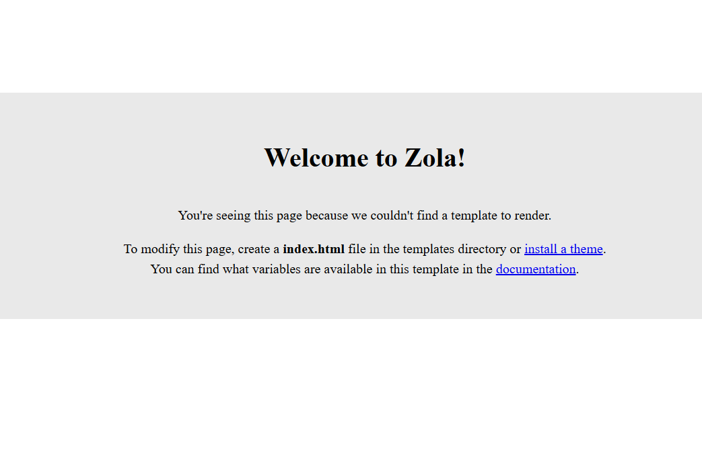
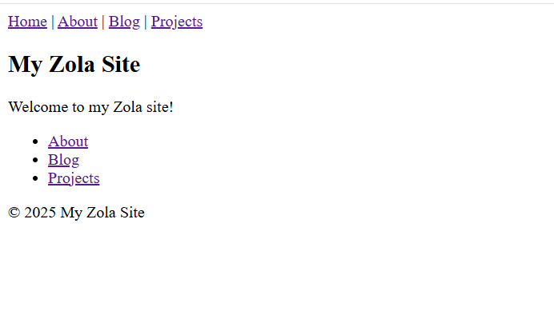

# 使用Zola 製作網站

說明如何使用Zola製作網站, 大致流程

安裝 Zola → 建立專案 → 修改 Theme → 部署到 GitHub Pages (使用 GitHub Actions加入新內容後自動更新網站)

## 一、安裝 Zola
Linux 環境

安裝 Zola
```bash
sudo snap install --edge zola
```

驗證
```bash
zola --version
```

## 二、建立 Zola 專案

建立新專案：
```bash
zola init mysite
```
→ 會生成 config.toml, content/, sass/, static/, templates/, themes

本機測試：
```bash
cd mysite
zola serve
```

→ 打開瀏覽器 http://127.0.0.1:1111, 可以看到Zola 歡迎畫面


## 三、加入簡單結構

### 1. 基本專案結構
```
mysite/
├─ config.toml
├─ content/
│  ├─ _index.md          # 首頁
│  ├─ about.md           # 關於我
│  ├─ blog/              # 部落格
│  │  ├─ _index.md
│  │  └─ first-post.md
│  └─ projects/          # 專案
│     ├─ _index.md
│     └─ project1/
│        ├─ _index.md
│        ├─ intro.md
│        └─ details.md
├─ static/
│  └─ img/
│     └─ me.jpg          # 照片
└─ templates/            # 可選（不自訂就用內建）
```
### 2. `config.toml` 最小設定
```
base_url = "https://example.com/"
title = "My Zola Site"
description = "個人網站 with Blog & Projects"
compile_sass = false
minify_html = true

[markdown]
highlight_code = true
highlight_theme = "base16-ocean-dark"
```

### 3. 內容檔案範例
首頁 `content/_index.md`
```
+++
title = "Welcome"
+++

歡迎來到我的網站！  
這裡有 [關於我](/about/)、[部落格](/blog/)、[專案](/projects/)。
```

關於我 `content/about.md`
```
+++
title = "About Me"
path = "about"
+++


### 簡歷
- 專業背景：軟體工程師
- 興趣：Rust, Web, 靜態網站

這裡可以放一份簡歷或更多詳細介紹。
```

Blog Section `content/blog/_index.md`
```
+++
title = "Blog"
paginate_by = 5
sort_by = "date"
+++

這裡是我的部落格文章。
```
Blog 文章 `content/blog/first-post.md`
```
+++
title = "第一篇文章"
date = 2025-09-01
+++

這是我用 Zola 發佈的第一篇文章！  
支援 Markdown, 程式碼區塊, 甚至公式：

```rust
fn main() {
    println!("Hello, world!");
}
```

Projects Section `content/projects/_index.md`
```markdown
+++
title = "Projects"
+++

這裡列出我的專案。
```
單一專案 `content/projects/project1/_index.md`
```
+++
title = "Project 1"
+++

這是 Project 1 的總覽。  
下方有幾份相關文件。
```
Project 文件 `content/projects/project1/intro.md`
```
+++
title = "Introduction"
weight = 1
+++

這是 Project 1 的簡介。
```
Project 文件 `content/projects/project1/details.md`
```
+++
title = "Details"
weight = 2
+++

這是 Project 1 的詳細說明文件。
```

## 四. 頁面模板
架構完成後, 還要加入各種頁面的模板 html

`templates/section.html`

這個模板會處理 section 頁面（例如 /blog/ 或 /projects/），自動列出其子頁面（文章或子目錄）。
```



  <section>
    <h1>{{ section.title }}</h1>
    {{ section.content | safe }}

    
      <ul>
        
          <li>
            <a href="{{ p.permalink }}">{{ p.title }}</a>
            <p>{{ p.summary }}</p>
          </li>
        
      </ul>
    

    
      <ul>
        
          
          <li><a href="{{ sub.permalink }}">{{ sub.title }}</a></li>
        
      </ul>
    
  </section>

```
`templates/page.html`

這個模板會處理 單頁內容（例如 /about/ 或單篇 blog 文章）。
```



  <article>
    <h1>{{ page.title }}</h1>
    {{ page.content | safe }}
  </article>

```
`templates/index.html` 主頁模板：
```


  <section>
    <h1>{{ config.title }}</h1>
    <p>Welcome to my Zola site!</p>

    <nav>
      <ul>
        <li><a href="/about/">About</a></li>
        <li><a href="/blog/">Blog</a></li>
        <li><a href="/projects/">Projects</a></li>
      </ul>
    </nav>
  </section>

```
`templates/base.html` 共用骨架：
```
<!DOCTYPE html>
<html lang="zh-Hant">
<head>
  <meta charset="utf-8">
  <title>{{ config.title }}</title>
  <meta name="viewport" content="width=device-width, initial-scale=1">
  <link rel="stylesheet" href="/style.css">
</head>
<body>
  <header>
    <nav>
      <a href="/">Home</a> |
      <a href="/about/">About</a> |
      <a href="/blog/">Blog</a> |
      <a href="/projects/">Projects</a>
    </nav>
  </header>

  <main>
    
  </main>

  <footer>
    <p>© {{ now() | date(format="%Y") }} {{ config.title }}</p>
  </footer>
</body>
</html>
```

完成就可以進行測試
```bash
zola serve
```
→ 打開瀏覽器 http://127.0.0.1:1111, 可以看到主頁換掉了


## 五、準備部署到 GitHub Pages

### 1. 設定 `config.toml`
```toml
base_url = "https://USERNAME.github.io/REPO_NAME/"
title = "My Zola Site"


個人/組織網站（repo 名稱是 username.github.io）：
base_url = "https://username.github.io/"

專案網站：
base_url = "https://username.github.io/repo-name/"
```
### 2. 建立 GitHub Repo
git init
git remote add origin git@github.com:USERNAME/REPO_NAME.git
git add .
git commit -m "init site"
git push -u origin main

3. 新增 GitHub Actions 工作流程

建立檔案 .github/workflows/deploy.yml：
```
name: Deploy Zola to GitHub Pages
on:
  push:
    branches: [ main ]

permissions:
  contents: read
  pages: write
  id-token: write

jobs:
  build:
    runs-on: ubuntu-latest
    steps:
      - uses: actions/checkout@v4
        with:
          submodules: true  # 如果使用 theme 子模組需要

      - name: Install Zola
        run: |
          ZOLA_VERSION=0.18.0
          curl -L https://github.com/getzola/zola/releases/download/v${ZOLA_VERSION}/zola-v${ZOLA_VERSION}-x86_64-unknown-linux-gnu.tar.gz | tar xz
          sudo mv zola /usr/local/bin/zola

      - name: Build
        run: |
          if [[ "${{ github.repository }}" == "${{ github.repository_owner }}/${{ github.repository_owner }}.github.io" ]]; then
            zola build
          else
            zola build --base-url "https://${{ github.repository_owner }}.github.io/${{ github.event.repository.name }}/"
          fi

      - uses: actions/upload-pages-artifact@v3
        with:
          path: ./public

  deploy:
    runs-on: ubuntu-latest
    needs: build
    environment:
      name: github-pages
    steps:
      - uses: actions/deploy-pages@v4
```
4. 啟用 GitHub Pages

到 repo → Settings → Pages。

Source 選擇 GitHub Actions。

六、完成 🎉

每次你在本地 修改內容 → git add . && git commit -m "update" && git push。

GitHub Actions 會自動跑 zola build，把結果部署到 Pages。

網站自動更新，不需要手動上傳 public/。

✅ 總結流程

安裝 Zola

zola init 建專案

加入 / 修改 Theme

寫內容

推到 GitHub → Actions 自動建置 + 部署


# Zola 工作流程（文字版）
1. 開發階段

指令：

zola serve


作用：

Zola 會自動把 content/ + templates/ + static/ 編譯成 HTML，存在記憶體裡。

啟動一個本機伺服器（預設 http://127.0.0.1:1111）。

你修改檔案（Markdown 或模板）時，會即時重新編譯並刷新瀏覽器。

特點：

不用生成 public/，也能看到網站。

只適合本機測試，不會產生可以部署的檔案。

2. 建置階段

指令：

zola build


作用：

把網站編譯出來，輸出到 public/ 資料夾。

public/ 裡都是靜態檔案（HTML / CSS / JS / 圖片）。

特點：

給「部署」用。

這些檔案才是要放到 GitHub Pages、GitLab Pages、S3、Netlify 的內容。

3. 部署階段

方式：

手動：把 public/ 上傳到伺服器或 Pages 分支。

自動：用 GitHub Actions / GitLab CI 在遠端建置並部署。

特點：

使用者訪問的網站，實際上就是 public/ 裡的檔案。
# 最小必要檔案
1. config.toml

必要性：必須有

Zola 的核心設定檔，沒有它 Zola 不知道網站的基本資訊。

最小範例：

base_url = "http://example.com"
title = "My Zola Site"

2. content/

至少要有一個 _index.md，不然首頁會是空的。

範例：

content/
└─ _index.md

+++
title = "Home"
+++
歡迎來到我的 Zola 網站！

3. templates/（可選，但通常需要）

如果只有 Markdown 內容而沒有模板，Zola 會用預設模板顯示。

若要自訂版面，至少要有：

base.html

index.html 或 section.html

4. static/（可選）

放置圖片、CSS、JS、favicon 等靜態資源。

沒有這個資料夾也能建置，但網站就比較陽春。

✅ 最小可行 Zola 專案結構
mysite/
├─ config.toml
├─ content/
│  └─ _index.md


這樣就能成功跑 zola serve，只是畫面很簡單。